# 기능 정의서

## 외출/조퇴, 휴가, 공가 신청 기능

### 수강생용 기능

#### 1. 외출/조퇴, 휴가, 공가 신청

* 기능 설명
  * 수강생이 외출/조퇴, 휴가, 공가 신청서를 제출하고 관련 서류를 첨부할 수 있습니다.
  * 신청서 양식을 pdf로 변환하고, zip으로 압축할 수 있습니다.
  * 제출 양식을 다운로드할 수 있습니다.
* 입력 항목
  * 신청 종류: 외출/조퇴, 휴가, 공가 중 선택
  * 이름: 문자열, 최대 50자
  * 신청 날짜: 날짜 (yyyy-mm-dd 형식)
  * 사유: 문자열, 최대 200자

#### 사용자 액션

##### 신청서 제출

* 제출 버튼 클릭
  * 입력 항목 유효성 검사 실행
  * 유효성 검사 오류 발생 시 제출 절차는 종료되며 사용자에게 오류 정보 알림
  * 유효성 검사 통과 시 제출 API 호출
  * API 호출 성공 후 요약 정보 표시
  * 신청 현황 화면으로 전환

* 취소 버튼 클릭
  * 신청서 작성 화면 초기화

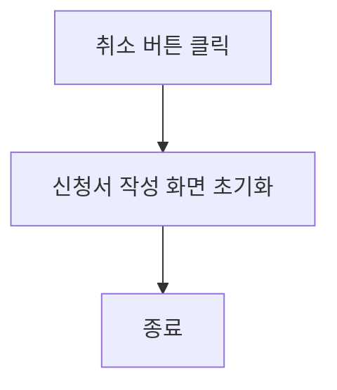

 

## 출결 기록 관리 기능

### 수강생용 기능

#### 출결 기록 관리

* 기능 설명
  * 수강생이 입실/퇴실 버튼을 통해 자신의 출결 기록을 관리할 수 있습니다.
* 입력 항목
  * 입실 시간: 시간 (hh:mm 형식)
  * 퇴실 시간: 시간 (hh:mm 형식)

#### 사용자 액션

##### 입실/퇴실 기록

* 입실/퇴실 버튼 클릭
  * 현재 시각을 입실/퇴실 시간으로 저장
  * 기록 저장 API 호출
  * API 호출 성공 후 요약 정보 표시
  * 출결 기록 화면으로 전환

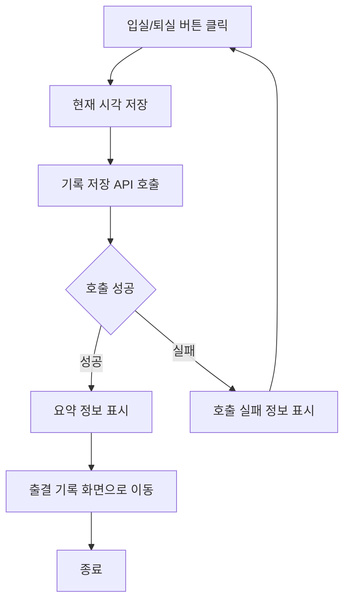

---

 

## 공지사항 갤러리 기능

### 수강생용 기능

#### 공지사항 갤러리

* 기능 설명
  * 수강생이 공지사항을 열람할 수 있습니다.
* 입력 항목
  * 없음

##### 3.1 사용자 액션

##### 공지사항 열람

* 공지사항 목록에서 항목 클릭
  * 선택한 공지사항의 상세 내용 표시

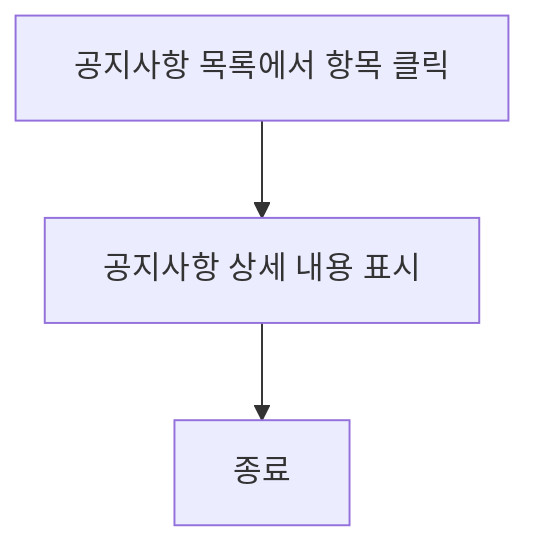

---

## 문서 발급 신청 기능

### 수강생용 기능

#### 문서 발급 신청

* 기능 설명
  * 수강생이 필요한 문서를 신청할 수 있습니다.
* 입력 항목
  * 문서 종류: 참여확인서, 수강증명서, 출석부 등등 선택
  * 신청 날짜: 날짜 (yyyy-mm-dd 형식)

##### 4.1 사용자 액션

##### 문서 신청

* 신청 버튼 클릭
  * 입력 항목 유효성 검사 실행
  * 유효성 검사 오류 발생 시 신청 절차는 종료되며 사용자에게 오류 정보 알림
  * 유효성 검사 통과 시 신청 API 호출
  * API 호출 성공 후 요약 정보 표시
  * 신청 현황 화면으로 전환

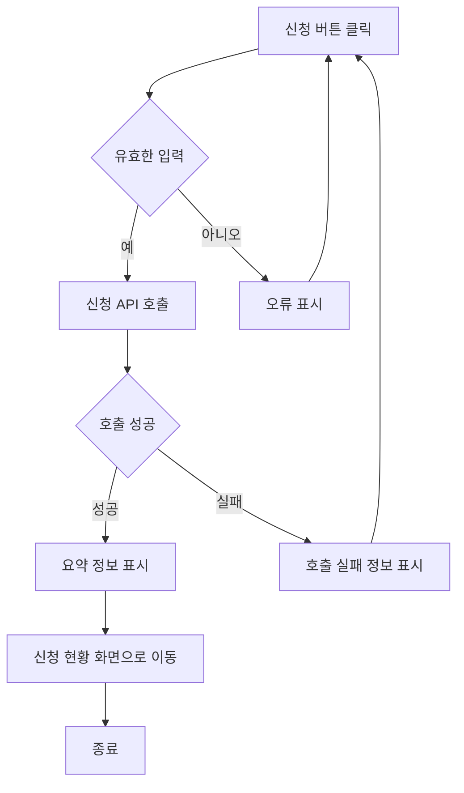

---

* 취소 버튼 클릭
  * 신청서 작성 화면 초기화

---

## 문의 기능

### 수강생용 기능

#### 문의

* 기능 설명
  * 수강생이 행정 관련 문의를 작성하여 제출할 수 있습니다.
* 입력 항목
  * 문의 제목: 문자열, 최대 100자
  * 문의 내용: 문자열, 최대 500자
  * 이름: 문자열, 최대 50자

#### 사용자 액션

##### 문의 작성

* 작성 버튼 클릭
  * 입력 항목 유효성 검사 실행
  * 유효성 검사 오류 발생 시 작성 절차는 종료되며 사용자에게 오류 정보 알림
  * 유효성 검사 통과 시 작성 API 호출
  * API 호출 성공 후 요약 정보 표시
  * 문의 현황 화면으로 전환

---

* 취소 버튼 클릭
  * 문의 작성 화면 초기화

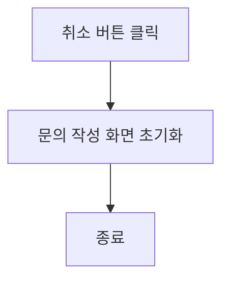

 

## 기업 공지 모음 기능

### 수강생용 기능

#### 기업 공지 모음

* 기능 설명
  * 수강생이 구인 광고를 열람할 수 있습니다.
* 입력 항목
  * 없음

#### 사용자 액션

##### 구인 광고 열람

* 구인 광고 목록에서 항목 클릭
  * 선택한 구인 광고의 상세 내용 표시

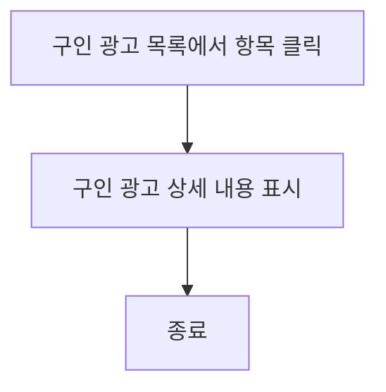

 

## 신청 현황 기능

### 수강생용 기능

#### 신청 현황

* 기능 설명
  * 수강생이 자신의 행정 신청 현황을 열람할 수 있습니다.
* 입력 항목
  * 없음

##### 7.1 사용자 액션

##### 신청 현황 열람

* 신청 현황 버튼 클릭
  * 신청한 항목들의 목록 표시

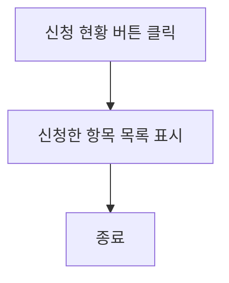

 

## 관리자용 기능

### 수강생 리스팅 페이지

* 기능 설명
  * 관리자가 수강생 목록을 확인하고 관리할 수 있습니다.
* 입력 항목
  * 없음

#### 사용자 액션

##### 수강생 목록 관리

* 수강생 목록 열람
  * 수강생 개별 프로필 페이지 제공
  * 수강생 프로필 삭제
  * 페이지네이션(Pagination) 기능 제공

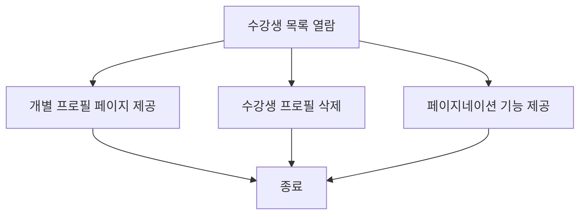

### 출결 관리 기능

* 기능 설명
  * 관리자가 수강생의 외출/조퇴, 휴가, 공가 신청을 확인하고 승인/반려할 수 있습니다.
  * 출결 관련 양식을 수정하고 관리할 수 있습니다.
* 입력 항목
  * 없음

##### 2.1 사용자 액션

##### 출결 신청 관리

* 출결 신청 확인
  * 외출/조퇴, 휴가, 공가 신청 확인 및 승인/반려
  * 출결 관련 양식 수정 및 관리
  * 페이지네이션(Pagination) 기능 제공

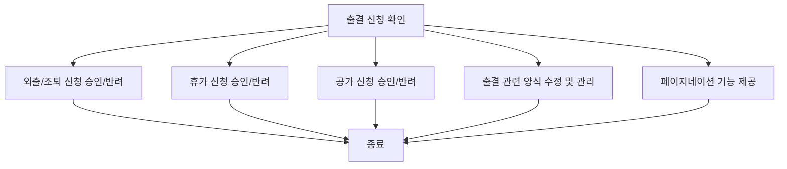

---

#### 공지사항 갤러리

* 기능 설명
  * 관리자가 공지사항을 업로드하고 관리할 수 있습니다.
* 입력 항목
  * 없음

#### 사용자 액션

##### 공지사항 관리

* 공지사항 업로드
  * 사진 및 글 업로드
  * 공지사항 양식 폼 등록
  * 제출된 양식 목록 확인
  * 페이지네이션(Pagination) 기능 제공

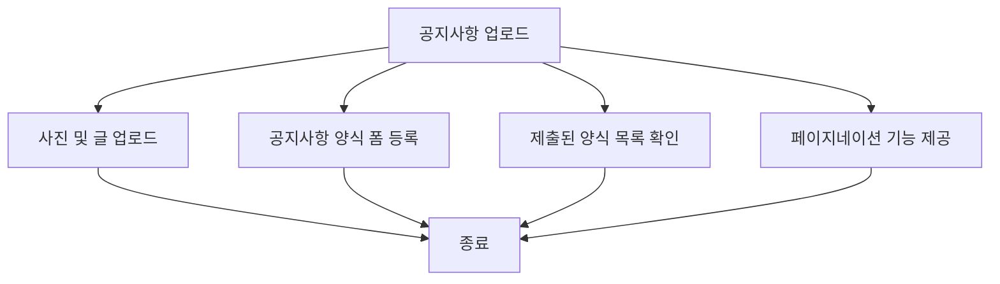

---

### 문서 발급 요청 관리

* 기능 설명
  * 관리자가 수강생의 문서 발급 요청을 확인하고 처리할 수 있습니다.
* 입력 항목
  * 없음

#### 사용자 액션

##### 문서 발급 요청 처리

* 문서 발급 요청 확인
  * 요청된 문서 발급 및 전달

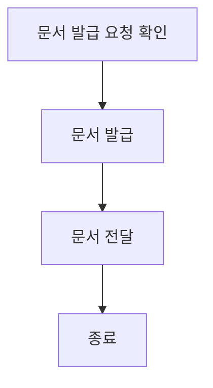

---

#### 문의 관리

* 기능 설명
  * 관리자가 수강생의 행정 문의를 확인하고 답변할 수 있습니다.
* 입력 항목
  * 없음

#### 사용자 액션

##### 문의 답변

* 문의 확인
  * 문의 내용 확인 및 답변 작성

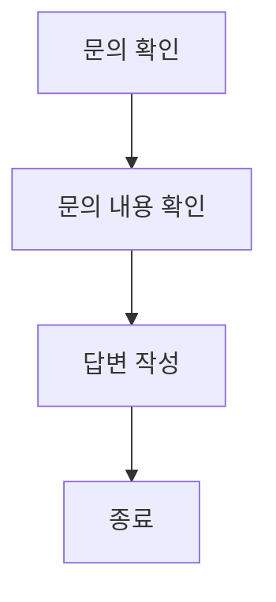

 

### 기업 공지 모음

* 기능 설명
  * 관리자가 구인 광고를 업로드하고 관리할 수 있습니다.
* 입력 항목
  * 없음

#### 사용자 액션

##### 구인 광고 관리

* 구인 광고 업로드
  * 구인 광고 작성 및 업로드

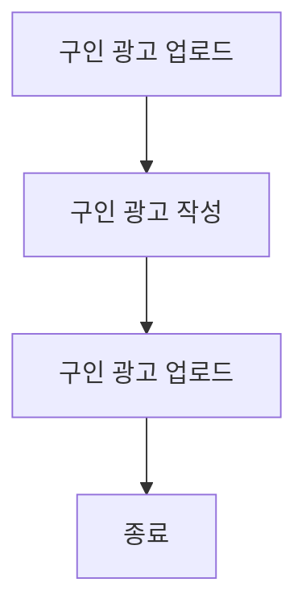

---

### 신청 현황

* 기능 설명
  * 관리자가 수강생들의 행정 신청 현황을 확인할 수 있습니다.
* 입력 항목
  * 없음

#### 사용자 액션

##### 신청 현황 열람

* 신청 현황 확인
  * 수강생들의 행정 신청 현황 열람

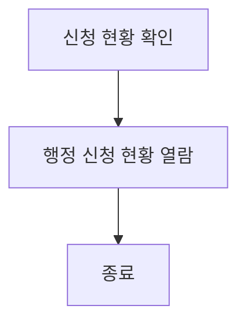
